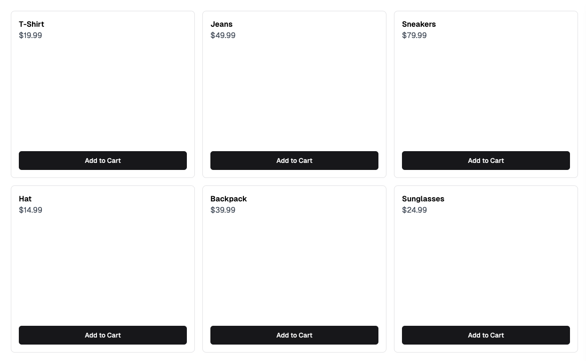
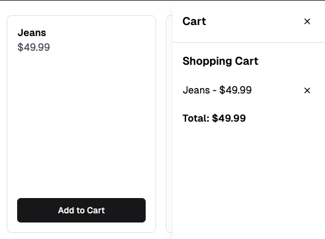
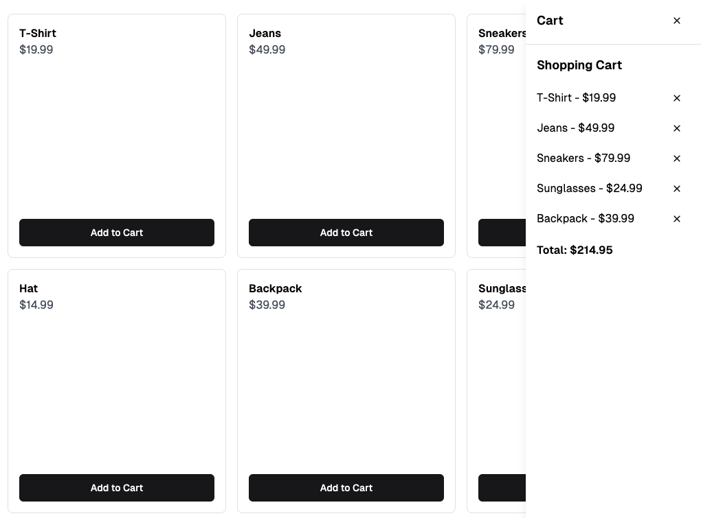

# Objective

To utilize the `useContext` and `useReducer` hooks in a React (Vite) project.

## Project Overview

### Day 1: Implementing `useContext`
- Create a main page that displays store items.
- Add a sidebar that shows items added to the cart.
- Each store item should have an **"Add to Cart"** button.
- Clicking the button will open the sidebar and display the selected item(s).
- Use the `useContext` hook to manage the cart state.
- Set up the initial layout with:
  - **Store items grid**.
  - **Sidebar component** for the cart.

### Day 2: Refactoring to `useReducer`
- Replace the `useContext` state management logic with `useReducer`.
- Ensure the cart functionality remains the same after refactoring.

## Additional Notes
- The provided screenshot is an example; feel free to design your own layout.
- Commit your work regularly to track progress.

## Screenshots

### Main page

### When "Add to Cart" clicked

### Adding few more items

## Resources
- [React Documentation: Context](https://react.dev/reference/react/useContext)
- [React Documentation: useReducer](https://react.dev/reference/react/useReducer)
